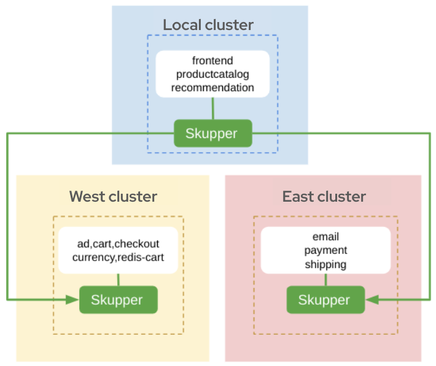

# Multi-cluster Cloud-Native grpc (microservices) application demo

This tutorial demonstrates how to deploy the [Online Boutique](https://github.com/GoogleCloudPlatform/microservices-demo/) microservices demo application across multiple Kubernetes clusters that are located in different public and private cloud providers.

This project contains a 10-tier microservices application developed by Google to demonstrate the use of technologies like Kubernetes.

<center>

</center>

In this tutorial, you will create a Virtual Application Network that enables communications across 3 clusters: local, east and west. You will then deploy a subset of the application's grpc based microservices to each cluster. You will then access the `Online Boutique` web interface to browse items, add them to the cart and purchase them.

Top complete this tutorial, do the following:

* [Prerequisites](#prerequisites)
* [Step 1: Set up the demo](#step-1-set-up-the-demo)
* [Step 2: Deploy the Virtual Application Network](#step-2-deploy-the-virtual-application-network)
* [Step 3: Deploy the application microservices](#step-3-deploy-the-application-microservices)
* [Step 4: Expose the microservices to the Virtual Application Network](#step-4-expose-the-microservices-to-the-virtual-application-network)
* [Step 5: Access the Online Boutique Application](#step-5-access-the-boutique-shop-application)
* [Cleaning up](#cleaning-up)
* [Next steps](#next-steps)

## Prerequisites

* The `oc` command-line tool ([installation guide](https://docs.openshift.com/container-platform/4.17/cli_reference/openshift_cli/getting-started-cli.html#installing-openshift-cli))
* The `skupper` command-line tool, the latest version ([installation guide](https://access.redhat.com/documentation/en-us/red_hat_service_interconnect/1.7/html-single/installation/index#installing-skupper-cli))

The basis for this demonstration is to depict the deployment of member microservices for an application across different clusters and for the ability of these microsservices to communicate across a Virtual Application Network. As an example, the cluster deployment might be comprised of:

* A private cloud cluster running on your local machine or any cloud provider
* Two public cloud clusters running in public cloud providers

While the detailed steps are not included here, this demonstration can alternatively be performed with three separate namespaces on a single cluster.

## Step 1: Set up the demo

1. On your local machine, make a directory for this tutorial and clone the example repo:

   ```bash
   mkdir boutique-demo
   cd boutique-demo
   git clone https://github.com/cmcornejo/skupper-example-grpc.git
   ```

3. Prepare the target clusters.

   1. On your local machine, log in to each cluster in a separate terminal session.
   2. In each cluster, create a namespace to use for the demo.
   3. In each cluster, set the kubectl config context to use the demo namespace [(see kubectl cheat sheet for more information)](https://kubernetes.io/docs/reference/kubectl/cheatsheet/)
   ```bash
   oc config set-context --current --namespace <namespace>
   ```
   4. (Optional) I use [kcli](https://kcli.readthedocs.io/en/latest/) as a way to handle virtual machines to create separate environments locally.

## Step 2: Deploy the Virtual Application Network

On each cluster, using the `skupper` tool, define the Virtual Application Network (VAN) and the connectivity for the peer clusters.

1. In the terminal for the west cluster, deploy the **west** application router, create a connection token for connections from the **west** cluster:

   ```bash
   skupper init --site-name west
   skupper token create west-token.yaml
   ```
2. In the terminal for the east cluster, deploy the **east** application router. Create a connection token for connections from the **east** cluster:

   ```bash
   skupper init --site-name east
   skupper token create east-token.yaml
   ```

3. In the terminal for the local cluster, deploy the **local** application router and define its connections to the **east** and **west** clusters.

   ```bash
   # we are only deploying the console in this cluster
   skupper init --site-name local --enable-console --enable-flow-collector --console-auth=unsecured
   skupper link create west-token.yaml
   skupper link create east-token.yaml
   ```

4. In each of the cluster terminals, verify connectivity has been established

   ```bash
   skupper link status
   ```

NOTE:

There are ONLY two links between sites:
* east -> local
* west -> local

**There isn’t link between east and west**

<center>

</center>

## Step 3: Deploy the application microservices

After creating the Virtual Application Network, deploy the grpc based microservices for the `Online Boutique` application. There are three `deployment .yaml` files
labelled *local, west, and east*. These files (arbitrarily) define a subset of the application microservices to deploy to a cluster.

| Deployment               | Microservices                            | Site   |
| ------------------------ | ---------------------------------------- | ------ |
| deployment-ms-local.yaml | frontend, productcatalog, recommendation | local  |
| deployment-ms-west.yaml  | ad, cart, checkout, currency, redis-cart | west   |
| deployment-ms-east.yaml  | email, payment, shipping                 | east   |


1. In the terminal for the **local** cluster, deploy the following:

   ```bash
   oc apply -f skupper-example-grpc/deployment-ms-local.yaml
   ```

2. In the terminal for the **west** cluster, deploy the following:

   ```bash
   oc apply -f skupper-example-grpc/deployment-ms-west.yaml
   ```

3. In the terminal for the **east** cluster, deploy the following:

   ```bash
   oc apply -f skupper-example-grpc/deployment-ms-east.yaml
   ```

## Step 4: Expose the microservices to the Virtual Application Network

There are three script files labelled *-local, -west, and east-*. These files expose the services created above to join the Virtual Application Network. Note that the frontend service is not assigned to the Virtual Application Network as it is setup for external web access.


| File                        | Deployments                              | Site   |
| --------------------------- | ---------------------------------------- | ------ |
| expose-deployments-local.sh | productcatalog, recommendation           | local  |
| expose-deployments-b.sh     | ad, cart, checkout, currency, redis-cart | west   |
| expose-deployments-c.sh     | email, payment, shipping                 | east   |


1. In the terminal for the **local** cluster, execute the following annotation script:

   ```bash
   skupper-example-grpc/expose-deployments-local.sh
   ```

2. In the terminal for the **west** cluster, execute the following annotation script:

   ```bash
   skupper-example-grpc/expose-deployments-west.sh
   ```

3. In the terminal for the **east** cluster, execute the following annotation script:

   ```bash
   skupper-example-grpc/expose-deployments-east.sh
   ```

## Step 5: Access The Boutique Shop Application

The web frontend for the `Online Boutique` application can be accessed via the *frontend-external* service. In the
terminal for the **lcoal** cluster, start a firefox browser and access the shop UI.

   ```bash
   /usr/bin/firefox --new-window  "http://$(oc get route frontend-external -o=jsonpath='{.spec.host}')/"
   ```

Open a browser and use the url provided above to access the `Online Boutique`.

## Step 6: Run the load generator

The `Online Boutique` application has a load generator that creates realistic usage patterns on the website.

1. In the terminal for the **local** cluster, deploy the load generator:

   ```bash
   oc apply -f skupper-example-grpc/deployment-loadgenerator.yaml
   ```
2. In the terminal for the **local** cluster, observe the output from the load generator:

   ```bash
   oc logs -f deploy/loadgenerator
   ```
3. In the terminal for the **local** cluster, stop the load generator:

   ```bash
   oc delete -f skupper-example-grpc/deployment-loadgenerator.yaml
   ```

## Step 7: Review Skupper Console

1. In the terminal for the **local** cluster, retrieve the skupper console url:

   ```bash
   skupper status
   Skupper is enabled for namespace "local" in interior mode. It is connected to 2 other sites. It has 10 exposed services.
   The site console url is:  https://skupper-local.apps.<ocp-basedomain>
   ```
3. Check Site tab:

<center>

</center>

4. Check Network tab:

<center>

</center>

5. Check Services tab:

<center>

</center>

6. Check Deployments tab:

<center>

</center>

<!-- 7. Check Addresses tab (tcp):

<center>

</center> -->

## Cleaning Up

Restore your cluster environment by returning the resources created in the demonstration. On each cluster, delete the demo resources and the skupper network:

1. In the terminal for the **local** cluster, delete the resources:

   ```bash
   skupper-example-grpc/unexpose-deployments-local.sh
   oc delete -f skupper-example-grpc/deployment-ms-local.yaml
   skupper delete
   ```

2. In the terminal for the **west** cluster, delete the resources:

   ```bash
   skupper-example-grpc/unexpose-deployments-west.sh
   oc delete -f skupper-example-grpc/deployment-ms-west.yaml
   skupper delete
   ```

3. In the terminal for the **east** cluster, delete the resources:

   ```bash
   skupper-example-grpc/unexpose-deployments-east.sh
   oc delete -f skupper-example-grpc/deployment-ms-east.yaml
   skupper delete
   ```

## Next Steps

 - [Try the example for multi-cluster distributed web services](https://github.com/skupperproject/skupper-example-bookinfo)
 - [Find more examples](https://skupper.io/examples/)
